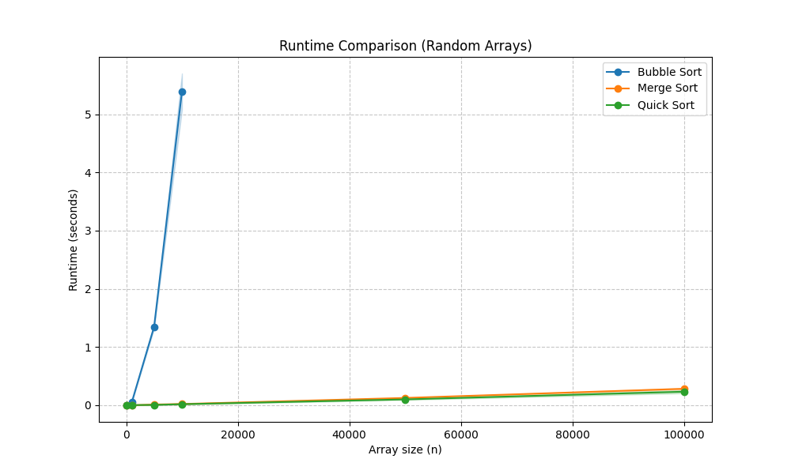
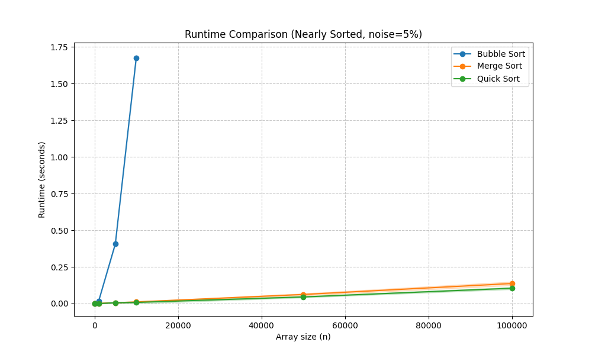
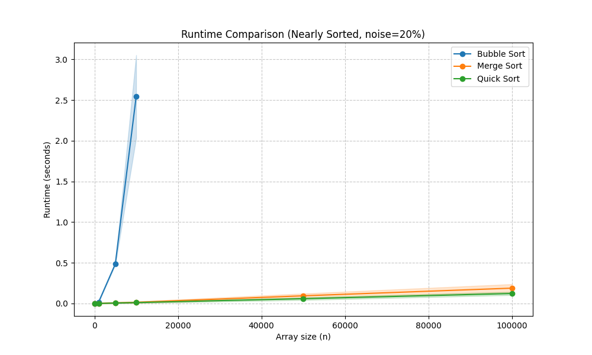

# Sorting Algorithms Analysis - Assignment 1

**Student Name:** Channah Freiman and Gilad Cohen 

## Overview
This project evaluates the performance of three sorting algorithms (Bubble Sort, Merge Sort, and Quick Sort) under different conditions: random arrays and nearly sorted arrays with noise.

## Selected Algorithms
1. **Bubble Sort (ID: 1)**: An O(n^2) algorithm with an added safety check for large arrays.
2. **Merge Sort (ID: 4)**: A stable O(n log n) divide-and-conquer algorithm.
3. **Quick Sort (ID: 5)**: An O(n log n) algorithm using a random pivot for efficiency.

## Handling Bubble Sort's Inefficiency
To handle Bubble Sort's O(n^2) complexity on massive arrays, we opted to run it only on smaller inputs (capped at n=10,000) rather than relying on theoretical estimations. This empirical approach prevents system crashes while providing a concrete, visual baseline to clearly demonstrate the performance gap between O(n^2) and O(n log n) algorithms.

## Results and Analysis

### Result 1: Random Arrays (Part B)

**Explanation:** For random arrays, Merge Sort and Quick Sort perform significantly better than Bubble Sort. As the array size (n) increases, the gap between O(n^2) and O(n log n) becomes very clear, making the recursive algorithms the better choice.

### Result 2: Nearly Sorted Arrays (5% Noise)

**Explanation:** In nearly sorted arrays (5% noise), the running times for Merge and Quick Sort remain relatively stable. Bubble Sort shows an improvement compared to the random case because fewer swaps are needed when the array is already partially ordered.

### Result 3: Nearly Sorted Arrays (20% Noise)

**Explanation:** With 20% noise, the array is more disordered than in the 5% case. We can observe how the increased randomness affects the algorithms; while Merge and Quick Sort remain stable, Bubble Sort's efficiency begins to decrease as it approaches its random-case performance.

## Usage
The script supports command-line arguments for algorithms (-a), sizes (-s), experiment type (-e), and repetitions (-r).

**Example Command (for 20% noise):**
```bash
python run_experiments.py -a 1 4 5 -s 100 500 1000 3000 5000 10000 100000 1000000 -e 2 -r 20
